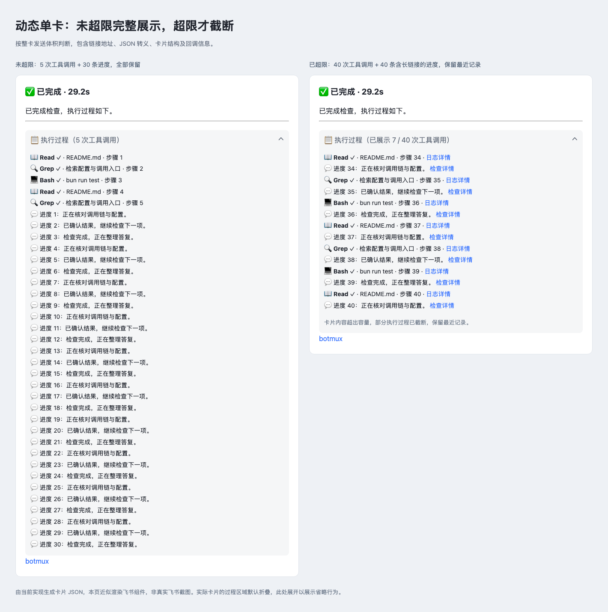
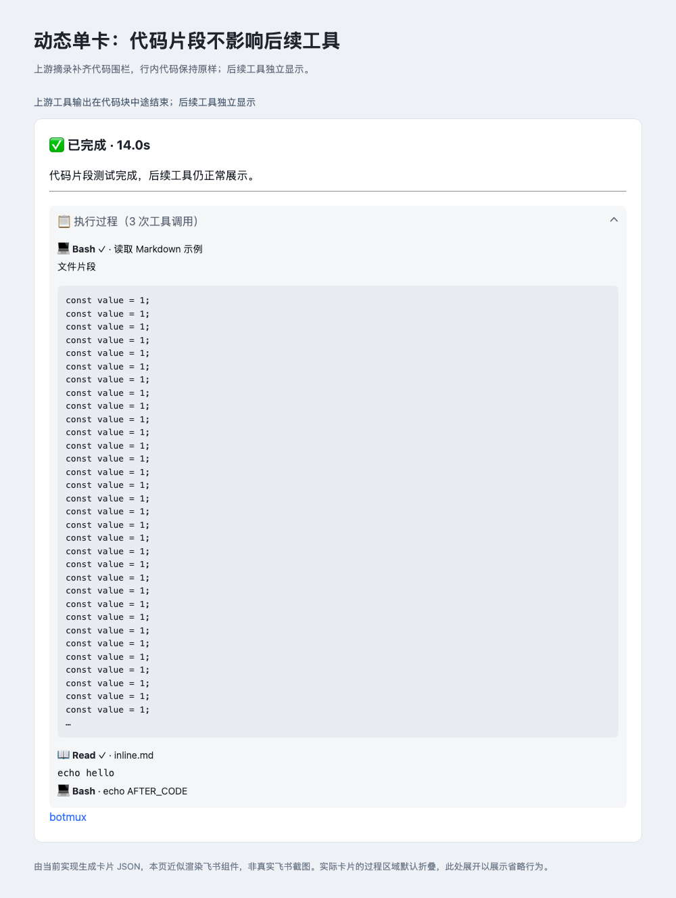
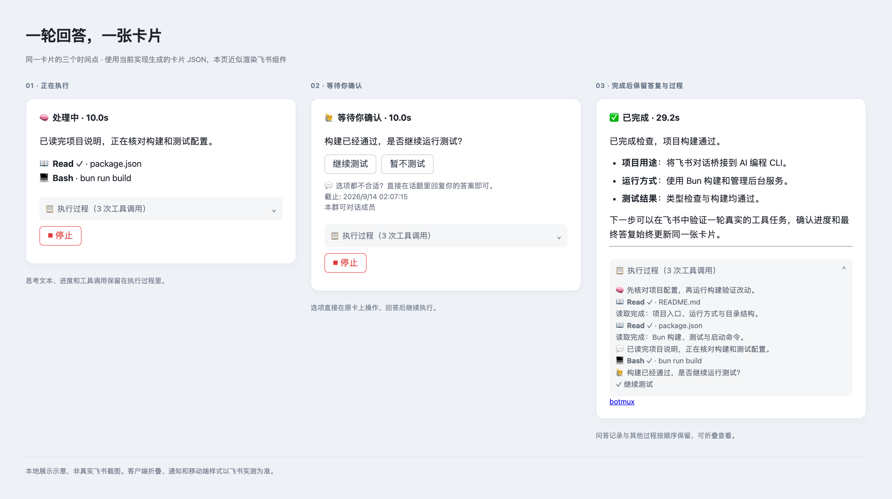

# 普通飞书对话单卡答复：首版实现与验收

本次解决一轮回答中的进度、工具调用、最终答复各自占用消息的问题。首版 opt-in；已有机器人默认兼容，不改变其发送契约。


上图由实际卡片 JSON 在本地近似渲染，非真实飞书截图。独立终端状态卡可另外开启，不属于图中的答复卡。

## 实现范围

- `replyCardMode=legacy|unified`，页面统一命名为“默认模式”和“动态单卡模式”，与 `/botconfig` 保持一致。每轮冻结模式。“显示独立状态卡”在两种模式下均可开关，切换模式保留其值。`disableStreamingCard` 和 `/card off` 仅关闭独立状态卡，不影响答复卡的动态更新。旧 `final-only` 配置兼容为 unified + disableStreamingCard，不再作为独立选项；升级前已接受轮次的投递状态仍可恢复。
- `services/turn-reply-card.ts` 保存每个 app/session/turn/attempt 的卡片 ID、进度、工具、执行状态与最终交付状态。跨进程文件锁串行化 Daemon 与短命 CLI 的更新；初次 POST 的正文与 UUID 在调用前持久化，重试保持一致。普通状态卡的 recall 流程不拥有这些答复卡。
- `core/turn-reply-card.ts` 处理入口资格、模式快照、工具更新合并、用量、短重试及断开后的状态收尾；`im/lark/turn-reply-card.ts` 复用现有 Markdown 渲染和反馈组件。工具输入/结果中的 @ 不执行为提及；当前版本记录 CLI 已输出的思考文本或摘要，不推断未输出的内部思考。
- `cli.ts` 管理普通当前轮发送，包括回复并 @ 本轮真人提问者；显式定向、辅助消息、通知其他对象的 @ 和 attention 仍独立。进度标记与最终交付标记分开，CLI 的首次明确 final 优先于终端 fallback。
- `worker-pool.ts` 将输入提交、工具事件、最终输出、terminal 接入同一卡片。最终交付和执行结束可以以任意顺序抵达；反馈索引沿用原有身份与策略，不新增反馈体系。
- Stop 使用现有 Ctrl-C 通道和管理员权限；额外验证卡片消息及实际运行回合。状态卡的停止反馈不会覆盖主答复卡。

## 首版边界

覆盖未启用文件沙盒的 Claude Code / Codex 普通飞书 IM 回合；存储与更新机制不依赖 macOS 专属命令。PTY/tmux 走原输入、恢复和终态链路，真实客户端行为仍需飞书验证。文件沙盒、其他 CLI、adopt、远程、v3、VC、文档和静默入口不切换到新交付模型。

文件沙盒的具体兼容修复、验证和限制见文末「文件沙盒兼容修复」。

使用同卡 PATCH，未启用 CardKit 打字机动画。工具更新约 1.2 秒合并一次；复用现有飞书客户端请求闸门。原生耗时有值时使用 Worker terminal 时间，未知时不补造终态耗时。

单卡首版不自动置顶主答复，也不内嵌审批；会话控制与原置顶逻辑保留在独立状态卡中，可自动显示或用 `/card` 手动打开。执行过程未超限时完整展示，不设置固定条数或独立字节配额。整卡发送请求超过飞书文档规定的 30 KB 时，才截断较早的过程记录；工具与文字分别保留最近记录，并显示截断提示和实际展示的工具数。体积计算包含卡片结构、回调标记及 JSON 转义开销。最终答案本身超限时仍交付 Markdown 附件；长的未分类公开发送记录在结束时附完整文件。

普通 PATCH 的通知、未读、客户端折叠和移动端表现未通过真实飞书验证；这里不承诺 PATCH 等同于新消息通知。永久无权限/卡片不可编辑时返回失败，首版不自动另发最终卡，以免把未知发送结果变成重复消息。用户撤回后不重建。

### 整卡超限验证（2026-09-14）

取消 20 条 / 7000 字节的过程预览配额，以完整发送请求的 30 KB 作为截断依据。旁白、工具参数与工具结果不再在单卡提取器中预先裁剪；卡片预览不会删除已收到的本地记录。最终答复和待回答问题优先使用空间，超限过程显示明确提示、近期工具和文字，以及实际展示的工具数。没有增加完整过程页面或过程附件。



本轮本地回归 **11 文件、883 项通过**，`bun run build`、`git diff --check` 通过。测试覆盖超过旧配额仍完整显示、真实超限后工具与文字的竞争、JSON 转义开销、截断代码围栏、长内容完整持久化、仅过程超限不新增消息、Ask 回调仍可作答，以及原有 CLI 转写与 CoT 兼容。上图为实际 JSON 的本地近似渲染，折叠/展开及 390px 窄屏检查通过；不替代真实飞书验收。

### 复查修复（2026-09-14）

- 长进度附件先发出、最终答复后到时，原实现会保留旧附件引用，遮住最终答复。现在内容变化时清除旧引用；附件去重 UUID 同时包含轮次和内容摘要，相同内容重试复用 UUID，不同内容不会被去重成旧文件。覆盖迟到的短/长最终答复、未知附件发送结果重试、PATCH 失败后的答复修正，以及跨 Store 实例恢复。
- CLI 上游工具结果摘录可能在 Markdown 代码块中途结束，即使整卡未超限也会影响后续工具行。现在每条过程记录独立补齐未闭合的代码围栏，并将补齐开销计入整卡体积；本地原始内容不变。使用真实转写提取器复现并覆盖反引号、波浪号两种围栏。

新增 5 项回归均在修复前失败，修复后通过。本轮单卡测试 **47 项**、兼容回归 **841 项**，合计 **11 文件、888 项通过**；完整构建及差异检查通过。未改动默认模式、其他 IM/CLI 的交付、沙盒资格、Ask 权限或平台/后端逻辑。本地测试运行于 macOS，使用模拟飞书传输。

再次复查补齐了行内代码的边界：反引号代码围栏的信息串不能包含反引号，因此同一行中用三个或四个反引号包住的代码不应被补上结束围栏。新增两项用例在修复前均导致后续工具进入代码块，修复后正常；本轮单卡 **49 项**和兼容回归 **841 项**均通过，合计 **890 项通过**，完整构建及差异检查通过。下方示意同时覆盖上游摘录与行内代码。



## 本地验证

新增覆盖：并发 CLI/Daemon 发布、未知首次 POST 重试、PATCH 失败不记为最终已送达、撤回不复活、长中文全文附件、final-only 无假消息 ID、执行终态与 final 乱序、回合/应用/attempt 隔离、模式冻结和跨入口资格、断开恢复、旧 Stop 按钮拒绝、配置持久化与 Dashboard 保存回滚。

Worker 更换时，待合并的工具快照同时更新发送回调与所有权校验；旧快照投递失败不阻断后续快照。运行时回归用例覆盖这两种交错时序。

Worker 集成测试通过真实 IPC 消息处理入口投递 thinking_update / final_output / turn_terminal，检查只发送一次新消息、后续 PATCH 使用同一个 ID。相关旧测试覆盖 CoT、原状态卡、反馈、发送去重及客户端展示设置。

结束状态也区分“已记录”和“飞书已确认更新”：终态 PATCH 暂时失败后，重试或新进程会继续更新原卡，保持已确定的执行结果和耗时。

2026-09-13 本地验证：

```bash
bun run test \
  test/turn-reply-card.test.ts test/turn-reply-card-runtime.test.ts \
  test/bridge-final-output-retry.test.ts test/bridge-fallback-gate.test.ts \
  test/card-handler-stop-compact.test.ts test/card-prefs-auto-start.test.ts \
  test/dashboard-streaming-card-pin-toggle.test.ts test/recall-frozen-cards.test.ts \
  test/worker-ready-display-mode.test.ts test/cot-message.test.ts \
  test/reply-card-style.test.ts test/card-runtime-status-bridge.test.ts \
  test/card-stream-store.test.ts test/cli-card-stream-dispatch.test.ts \
  test/bot-config-store.test.ts test/skill-feedback-card.test.ts --silent
bun run build
git diff --check
```

上述回归 16 个文件、533 项测试通过，完整构建和差异格式检查通过。以实际构建函数生成了两种状态的卡片 JSON，并用本地浏览器生成展示示意、检查过程面板展开；这是近似渲染，不能替代飞书客户端验收。

本机部署：`bun run use:here` 将入口指向当前 checkout，用户已配置测试机器人，Dashboard 和 daemon 已运行。用户首轮飞书测试发现 `--mention-back --response-kind final` 被当成独立通知，导致过程和答复分离。现已收窄为“通知其他对象、机器人或身份未知对象时独立发送”；启动等待提示复用当前卡片。Dashboard 改用现有下拉菜单，将模式说明与控件对齐，手动状态卡控制与答复展示分开说明。

新增 `test/cli-send-reply-card.test.ts` 通过真实 CLI 子进程与封闭的飞书 API 测试桩，覆盖 Claude Code/Codex 的 `--mention-back`、显式 @ 提问者、无 @、其他收件人、机器人与未知身份；检查只 PATCH 原消息、保留工具过程并记录正确的最终发送标记。Worker receipt 回归覆盖动态单卡、关闭自动进度和默认模式。飞书真实发送仍由用户执行。

补充验证：12 个相关测试文件共 435 项通过（旧发送路径的源码断言更新后单独复跑通过）；`bun run build`、`git diff --check` 通过。浏览器检查了单卡设置、对齐、菜单展开和选中状态。修复已部署本地 daemon；尚待用户对新一轮飞书消息进行验收。

## 改动文件

| 模块 | 文件 |
| --- | --- |
| 回合持久化与发布 | `src/services/turn-reply-card.ts` |
| 运行时适配与生命周期 | `src/core/turn-reply-card.ts`、`src/core/worker-pool.ts`、`src/core/types.ts`、`src/daemon.ts` |
| 飞书渲染、停止、命令 | `src/im/lark/turn-reply-card.ts`、`src/im/lark/card-handler.ts`、`src/core/command-handler.ts` |
| 显式发送与最终答复去重 | `src/cli.ts`、`src/worker.ts`、`src/services/bridge-fallback-gate.ts` |
| 配置与 Dashboard 接口 | `src/bot-registry.ts`、`src/services/card-prefs-store.ts`、`src/services/bot-config-store.ts`、`src/core/dashboard-ipc-server.ts`、`src/dashboard/bot-payload.ts` |
| Dashboard 与文案 | `src/dashboard/web/bot-defaults.ts`、`src/dashboard/web/bot-defaults-page.tsx`、`src/dashboard/web/i18n.ts`、`src/i18n/zh.ts`、`src/i18n/en.ts` |
| 新增及更新的回归测试 | `test/turn-reply-card.test.ts`、`test/turn-reply-card-runtime.test.ts`、`test/bridge-final-output-retry.test.ts`、`test/card-handler-stop-compact.test.ts`、`test/card-prefs-auto-start.test.ts`、`test/dashboard-streaming-card-pin-toggle.test.ts` |
| 用户文档与验收 | `docs-site/docs/zh/cards.md`、本文 |

## 飞书手动验收

1. 在测试机器人 Dashboard 选择动态单卡模式，并关闭“显示独立状态卡”。切换默认/动态模式时确认这个开关不变。
2. 新开一轮：“读取 README.md 和 package.json，先给一条进度，再总结你看到的内容；最终用 botmux send --response-kind final 发送。”预期同一卡片展示处理中、工具调用，结束后出现完整答复、折叠过程；没有独立 CoT 或自动终端状态卡。
3. 再问一次，确认创建新的答复卡，上一轮答复仍保留。分别在话题和普通群检查回复落点。
4. 做一次较长的工具任务，点击本轮 Stop。预期停止当前任务、保留会话和答复卡；再开始新任务后点击旧卡的 Stop，不能影响新任务。
5. 开启“显示独立状态卡”，群内曾 `/card off` 时执行 `/card on`。新一轮应有独立终端状态卡和动态答复卡，两者分别更新。再用 `/card off`，答复卡仍动态更新，独立状态卡不再自动显示；切回默认模式，独立状态卡仍遵守同一开关。
6. 关闭工具输出，确认新一批更新不再显示输出内容；试 `/cot show` 与 `/card`，后者仍是独立诊断卡。检查反馈按钮（仅在原反馈策略已开启时出现）、语音总结和附件。
7. 生成超过卡片预算的长中文答复，检查附件全文；检查代码、表格、链接、移动端折叠、历史读取与引用是否完整。
8. 可选测试：运行中重启、断网恢复、撤回主卡片；观察状态能否收尾、恢复后是否仍更新原卡，以及撤回后是否保持不重建。

飞书实测由用户执行；没有在本次本地测试中向真实聊天发送测试消息。


## 同轮提问与执行过程补齐（2026-09-14）

- 普通同轮 Ask（显式命令与已有 Ask hook）复用原卡。问题使用 Card JSON 2.0 按钮，broker 继续负责权限、nonce、选择、超时、文字/桌面答复与恢复；多个问题按顺序展示，结束后归入过程。
- 单卡采用一条接收顺序时间线，包含 CLI 已输出的思考文本或摘要、工具调用、公开进度和问答。过程开关统一叫“展示执行过程”，工具输出继续可选；未输出的内部思考不作推断。整卡超限时截断过程并提示，不提供额外的完整过程页面。
- 卡片点击先 ACK，再从 broker 读取最新状态，经原有文件锁发布整卡，避免同步回调携带的旧快照覆盖新答复。终态问答不可被迟到的 pending/toggle 复活。
- 同轮与同受众之外的交互保持独立。大问卷（选项总数 >16 或问题 JSON >3000 UTF-8 字节）使用独立卡以完整保留选项。独立状态卡开关不变；独立审批、授权申请、附件、跨对象通知与手动卡片流不改。
- 兼容 macOS/Linux 的文件锁与既有 IM API；不新增进程/PTY 平台分支。只为既有动态单卡记录接入 Ask，默认模式和其他 CLI 的发送路径保留。




本轮最终验证（2026-09-14，本地 macOS）：24 个相关文件 911 项测试通过，卡片回调定向测试另 29 项通过，共 **940 项通过**。

```bash
bun run test \
  test/command-handler.test.ts test/ask-card.test.ts test/ask-broker.test.ts \
  test/ask-resume-restart.test.ts test/ask-resume-contract.test.ts test/ask-api.test.ts \
  test/ask-args.test.ts test/ask-types-shape.test.ts test/ask-unauthorized-grant.test.ts \
  test/ask-answer-talk-dispatch.test.ts test/ask-hook-claude.test.ts \
  test/ask-hook-codex.test.ts test/ask-hook-opencode.test.ts test/cot-message.test.ts \
  test/cli-send-reply-card.test.ts test/bridge-final-output-retry.test.ts \
  test/dashboard-streaming-card-pin-toggle.test.ts test/card-prefs-auto-start.test.ts \
  test/card-handler-stop-compact.test.ts test/cmd-hook.test.ts test/ask-cli.test.ts \
  test/turn-reply-ask.test.ts test/turn-reply-card.test.ts test/turn-reply-card-runtime.test.ts \
  --no-file-parallelism --silent
bun run test test/event-dispatcher.test.ts -t 'card.action.trigger.*ack-safe slow handlers' --silent
bun run switch:here
bun run daemon:restart
bun run daemon:status
git diff --check
```

- 同卡问答覆盖并发进度/最终答复、多选与空提交、多个 Ask 排队、权限/消息/应用隔离、超时、重启恢复、终态失效、原生 hook 轮次固定、普通群锚点和执行过程时间线。ACK 后强制用最新持久状态 PATCH；broker 已接受的答案晚于执行终态发布时，仍保留真实回答。
- 默认模式、原生 CoT、其他 CLI hook 和独立状态卡回归通过。上一版 CI 的 `/cot show` 用例失败已在本地复现：共享文件系统 mock 把不存在的单卡记录模拟为存在。该用例现在明确模拟没有持久化记录，仍验证原生 CoT 路径；修复后通过。
- 标题只显示状态与耗时，调用次数保留在过程折叠栏；过程条目之间只换行，工具输出内部空行保留；问答选项使用原生图标显示未选/已选状态。
- 飞书手动测试的截图反馈已用于调整排版。预览图由当前卡片 JSON 在本地近似渲染，折叠可展开，390px 窄屏无横向溢出。新的原生选项图标和精简标题仍需客户端确认；本地自动测试未向真实聊天发送消息。

## 文件沙盒兼容修复（2026-09-14）

文件沙盒的白名单未开放 `turn-reply-cards/`。原实现允许 daemon 创建动态卡，却要求沙盒内的 `send` 读取并锁定共享记录，无法保证同卡交付。锁的 stale-claim/candidate 和溢出附件也位于这个共享目录，不能通过放开整个目录来破坏会话间隔离。

- 在模式缓存和持久化记录之前排除文件沙盒会话，复用已冻结的 session/Worker 配置，并覆盖旧 `readIsolation` 和全局 `BOTMUX_SANDBOX=1`。未冻结的新会话使用机器人配置；配置切换不改变已有 Worker 的隔离状态。
- Ask 使用同一个无文件副作用的隔离判断，已有单卡记录不能让沙盒问题重新进入单卡；独立 Ask 的答题流程保持可用。
- `send` 根据持久化 sandbox 状态和 Worker 的文件隔离标记跳过旧单卡。Linux 宿主 relay 保留该标记，因此可读的历史记录也不能被重新启用。
- 不修改 `fs-policy.ts` 和文件锁权限。Dashboard 中英文说明及用户文档明确文件沙盒暂时使用默认模式。其他 CLI、独立状态卡、默认 CoT、问答 broker 和原发送去重策略保持原行为。

验证结果：新增回归在修复前产生 14 项失败；修复后定向测试 **152 项通过**，兼容回归 **690 项通过**，合计 **842 项通过**。Linux bwrap 专用测试 **10 项跳过**，本机无法执行，不计入通过数。`bun run build` 与 `git diff --check` 通过。

```bash
bun run test test/turn-reply-card-runtime.test.ts test/turn-reply-ask.test.ts \
  test/cli-send-reply-card.test.ts test/fs-policy.test.ts --no-file-parallelism --silent
bun run test test/bridge-final-output-retry.test.ts test/cot-message.test.ts \
  test/command-handler.test.ts test/ask-api.test.ts test/ask-card.test.ts \
  test/ask-hook-claude.test.ts test/ask-hook-codex.test.ts test/ask-hook-opencode.test.ts \
  test/ask-cli.test.ts test/sandbox.test.ts test/sandbox-dispatch-routing.test.ts \
  test/sandbox-session-data-dir.test.ts test/dashboard-streaming-card-pin-toggle.test.ts \
  test/turn-reply-card.test.ts --no-file-parallelism --silent
bun run build
git diff --check
```

另用临时目录、真实 `buildFsPolicy`/`compileToSeatbelt` 和 `sandbox-exec` 做了 macOS 内核探针：共享记录内容读取报 `EPERM`，自身 `turn-sends/sid.jsonl` 可写，`bots-info.json` 可读。Bun 1.4.2 下记录的 `existsSync` 为 `true`，因此本机不能复现“existsSync=false 后另发消息”的具体推导，更可能在读取阶段报错；Linux 又有宿主 relay，不能声称两端必然表现相同。实际确认的是权限缺口与错误的功能资格。探针只访问临时测试数据，未在真实 sandbox Bot 的飞书对话中做端到端验证。

### 同步 master 后的兼容验证

合并 `1352ad80`，保留宿主 Ask 的来源字段、送达后计时和跨身份打断校验，同时保留单卡交付结果。Ask/恢复/身份权限定向 6 文件 **126 项通过**；扩展到单卡、沙盒、会话启动、队列、转移和中断的 32 文件批量回归：**1404 项通过、1 项失败、10 项跳过**，完整构建通过。

唯一失败是已有 `/tw` worktree 用例中 `/var` 与 `/private/var` 的路径比较。在独立的未修改 master 副本中运行以下同一用例，同样失败；本分支将 `TMPDIR` 设为规范的 `/private/var/.../T` 后复跑，**1 项通过**。未为这个既有路径问题修改业务代码或测试预期。

```bash
bun run test test/ask-broker.test.ts test/ask-resume-restart.test.ts \
  test/turn-reply-ask.test.ts test/turn-reply-card-runtime.test.ts \
  test/active-turn-authority.test.ts test/cross-principal-interruption-store.test.ts \
  --no-file-parallelism --silent
# 以下命令分别在 master 对照副本和本分支运行；本分支复跑时使用规范化 TMPDIR。
bun run test test/daemon-rename-route.test.ts \
  -t 'creates a topic that starts from a worktree' --silent
bun run build
```
